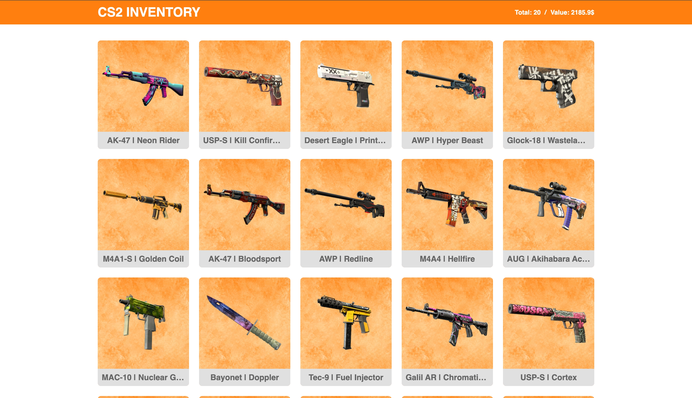
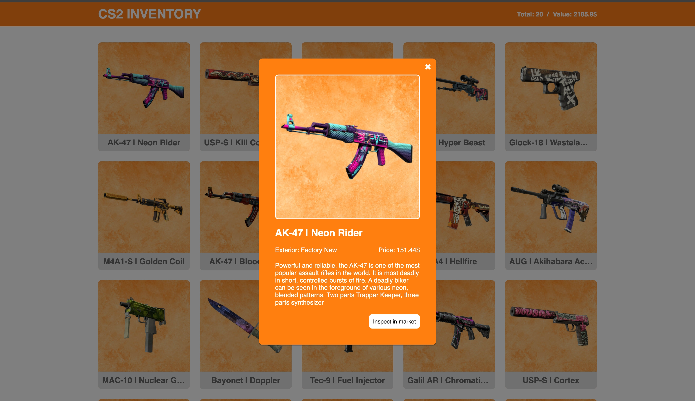

# CS2 Inventory

## Introduction

This application provides a visual representation of inventory items from the
game CS2 (Counter-Strike 2). It allows users to view and manage their in-game
items, displaying details such as item name, rarity, and market value. The
inventory is presented through intuitive cards, with the option to view
comprehensive information about each item in a modal window. Users can interact
with the inventory, track their collection, and access direct links to the Steam
Market for trading purposes.

## Features

- **Weapons Cards**: The page displays 20 weapon cards, along with information
  about the total number of weapons and the current inventory value..
- **Modal Window**: The modal window displays complete information about
  weapons, including their name, exterior, price, description, and a link to the
  Steam Market. Scrolling on the page is disabled when the modal is open. The
  modal can be closed by clicking on the backdrop, the close icon, or by
  pressing the Esc key.

## Screenshots

## Technologies Used:

## Demo

This project is deployed on Vercel. Check it out:
[**CS2 Inventory**](https://cs2-inventory.vercel.app/)
